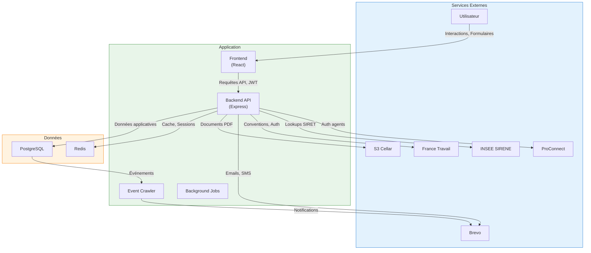
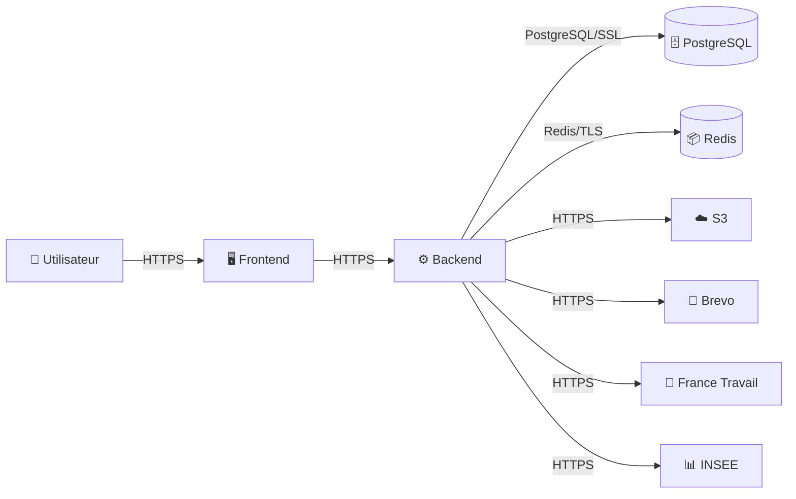
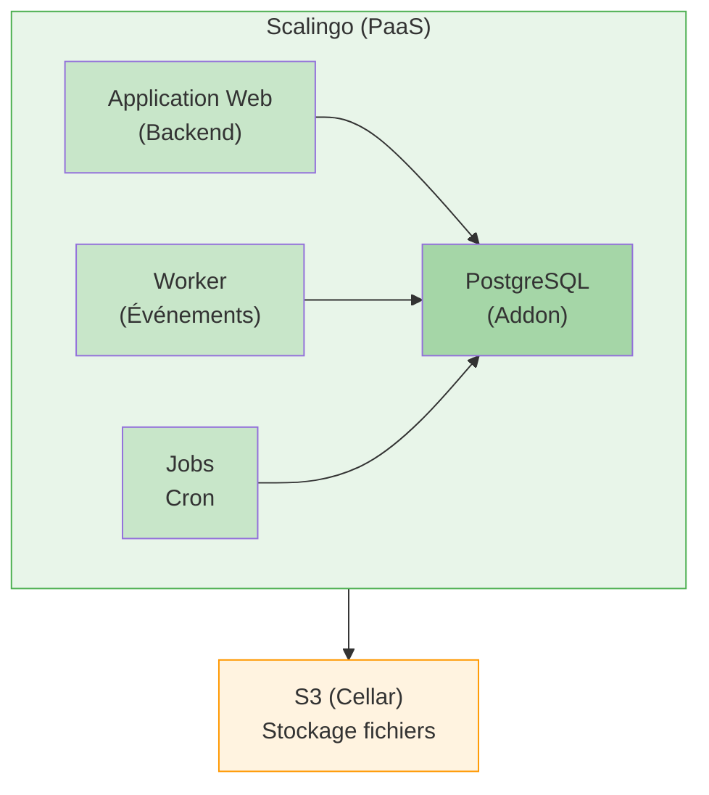

# Immersion Facilitée - Architecture

## Vue d'ensemble

Immersion Facilitée est un monorepo TypeScript suivant une architecture hexagonale (ports & adaptateurs) avec des principes de Domain-Driven Design.

## Style d'architecture

- **Pattern** : Monorepo Monolithe
- **Style** : Architecture Hexagonale (Ports & Adaptateurs)
- **Paradigme** : Domain-Driven Design

## Stack technique

| Couche | Technologies |
|--------|--------------|
| **Langage** | TypeScript 5.8 |
| **Frontend** | React 18, Vite, Redux Toolkit, DSFR |
| **Backend** | Node.js 22, Express.js, Kysely |
| **Base de données** | PostgreSQL 13, Redis |
| **Infrastructure** | Scalingo (PaaS, SecNumCloud osc-secnum-fr1), S3 (Cellar) |

## Composants

### Frontend (`front/`)
SPA React avec le design system DSFR.
- Technologie : React 18, Vite, Redux Toolkit
- Responsabilités : Interface utilisateur, gestion des formulaires, gestion d'état

### Backend (`back/`)
Serveur API Express.js avec architecture hexagonale.
- Technologie : Express.js, Kysely, Node.js 22
- Responsabilités : Logique métier, endpoints API, intégrations

### Shared (`shared/`)
Types TypeScript et utilitaires partagés.
- Technologie : TypeScript
- Responsabilités : DTOs, types domaine, schémas de validation (Zod)

### Base de données
PostgreSQL avec l'ORM Kysely.
- Technologie : PostgreSQL 13, Kysely
- Responsabilités : Persistance des données, transactions

### Cache Redis
Couche de cache en mémoire.
- Technologie : Redis
- Responsabilités : Stockage de session, limitation de débit, mise en cache

### Pipelines (`back/src/domains/core/events/`)
Traitement de jobs temporels avec tâches planifiées.
- Technologie : Node.js, PostgreSQL
- Responsabilités : Jobs asynchrones, tâches planifiées, traitement d'événements

### Event Crawler
Processeur d'événements avec pattern Outbox.
- Technologie : Node.js
- Responsabilités : Publication d'événements domaine, notifications externes

### Libs (`libs/`)
Bibliothèques internes partagées.
- Technologie : TypeScript
- Responsabilités : Composants React du design system, templates d'emails HTML

### Tests E2E (`playwright/`)
Suite de tests end-to-end.
- Technologie : Playwright
- Responsabilités : Tests d'intégration, tests de non-régression

## Diagramme système

---

## Data Flow Diagram (DFD)

### Inventaire des flux de données

| ID | Nom | Source | Destination | Données | Protocole | Chiffrement |
|----|-----|--------|-------------|---------|-----------|-------------|
| `flow-user-to-frontend` | Navigateur → Frontend | Utilisateur | Frontend | Interactions, Formulaires | HTTPS | TLS 1.2+ |
| `flow-frontend-to-backend` | Frontend → Backend | Frontend | Backend | Requêtes API, JWT | HTTPS | TLS 1.2+ |
| `flow-backend-to-db` | Backend → Database | Backend | PostgreSQL | Données applicatives | PostgreSQL/SSL | TLS |
| `flow-backend-to-redis` | Backend → Redis | Backend | Redis | Cache, Sessions | Redis/TLS | TLS |
| `flow-backend-to-s3` | Backend → S3 | Backend | S3 (Cellar) | Documents PDF, Fichiers | HTTPS | TLS |
| `flow-backend-to-brevo` | Backend → Brevo | Backend | Brevo | Emails, SMS, Destinataires | HTTPS | TLS |
| `flow-backend-to-ft` | Backend → France Travail | Backend | France Travail | Conventions, Authentification | HTTPS | TLS |
| `flow-backend-to-insee` | Backend → INSEE | Backend | INSEE SIRENE | Lookups SIRET, Infos entreprises | HTTPS | TLS |

### Flux de données principaux

1. **Requête utilisateur** - Navigateur → Frontend → API Backend (HTTPS, JWT)
2. **CRUD Convention** - Backend → PostgreSQL (transactionnel, SSL)
3. **Authentification** - Backend ↔ ProConnect/France Travail (OAuth2/OIDC)
4. **Recherche** - Frontend → Backend → PostgreSQL (full-text search)
5. **Notifications** - Event Crawler → Brevo (emails/SMS)
6. **Sync France Travail** - Backend ↔ API France Travail (OAuth2)
7. **Stockage de fichiers** - Backend → S3 Cellar (IAM credentials)
8. **Mise en cache** - Backend ↔ Redis (TLS)

## APIs

### API REST (`/api/*`)
- Type : REST
- Authentification : JWT (ES256)
- Documentation : OpenAPI/Swagger
- Limitation de débit : Oui

### API Admin (`/admin/*`)
- Type : REST
- Authentification : JWT + Rôle Admin
- Accès : Utilisateurs back-office uniquement

### Webhooks
- Type : Récepteurs de webhooks
- Authentification : Vérification de signature
- Sources : France Travail, Brevo

## Patterns architecturaux

### Architecture Hexagonale
Pattern ports et adaptateurs séparant le domaine de l'infrastructure.
- Emplacement : `back/src/domains/*/`
- Avantages : Testabilité, flexibilité, frontières claires

### Domain-Driven Design
Bounded contexts avec agrégats, entités et value objects.
- Emplacement : `shared/src/`, `back/src/domains/`
- Contextes : Convention, Établissement, Agence, Authentification, Notification

### Transactional Outbox
Publication d'événements fiable utilisant une table outbox en base de données.
- Emplacement : `back/src/domains/core/events/`
- Avantages : Livraison garantie, cohérence à terme

### Unit of Work
Pattern de gestion de transactions pour les opérations base de données.
- Emplacement : `back/src/domains/core/unit-of-work/`
- Avantages : Opérations atomiques, support du rollback

### Repository Pattern
Couche d'abstraction pour l'accès aux données.
- Emplacement : `back/src/domains/*/adapters/`
- Avantages : Testabilité, indépendance de la base de données

### CQRS (Léger)
Séparation des modèles de lecture et d'écriture où bénéfique.
- Emplacement : Divers use cases
- Avantages : Requêtes optimisées, intention claire

## Bounded Contexts

1. **Convention** - Gestion du cycle de vie des conventions PMSMP
2. **Établissement** - Annuaire d'entreprises et disponibilités
3. **Agence** - Gestion des organisations prescriptrices
4. **Authentification** - Identité et accès utilisateur
5. **Notification** - Messagerie multi-canal

## Architecture de déploiement

---
*Généré par OpenSecKit v4.0.0*
