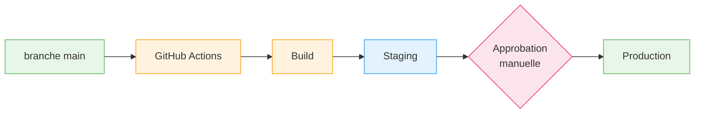

# Immersion Facilitée - Guide des opérations

> Généré par OpenSecKit v4.0.0 - /osk-discover
>
> **Public cible** : DevOps, SREs

---

## Tableau de bord

| Métrique | Valeur |
|----------|--------|
| **Environnements** | 5 |
| **Tableaux de bord** | 2 |
| **Jobs planifiés** | 5 |
| **Runbooks documentés** | 1 |
| **Fréquence de déploiement** | Continue (CI/CD) |
| **Couverture on-call** | Jours ouvrés (9h-18h) |

### Résumé des alertes par sévérité

| Sévérité | Canaux |
|----------|--------|
| Critique, Élevée | Discord, Email |
| Moyenne, Info | Discord |

---

## Environnements

| Environnement | URL | Objectif |
|---------------|-----|----------|
| **Local** | http://localhost:3000 | Développement |
| **Review** | Dynamique par PR | Validation de PR |
| **Staging** | https://staging.immersion-facile.beta.gouv.fr | Pré-production |
| **Production** | https://immersion-facile.beta.gouv.fr | Service en ligne |
| **Pentest** | https://pentest.immersion-facile.beta.gouv.fr | Bug bounty / Tests de pénétration |

## Infrastructure

### Scalingo PaaS

| Paramètre | Valeur |
|-----------|--------|
| **Région** | osc-secnum-fr1 |
| **Certification** | SecNumCloud (ANSSI) |
| **HDS** | Non |

| Composant | Instance | Notes |
|-----------|----------|-------|
| Application Web | Backend + Frontend statique | Auto-scaling |
| Worker | Event Crawler | Instance unique |
| PostgreSQL | Addon | Sauvegardes quotidiennes |
| Redis | Addon | Session/cache |
| Adminer | Addon | Administration BDD (équipe plateforme) |

### Services externes

| Service | Objectif | SLA |
|---------|----------|-----|
| Scalingo | Hébergement | 99.9% |
| Brevo | Envoi d'emails | 99.9% |
| S3 (Cellar) | Stockage de fichiers | 99.9% |
| API France Travail | Intégration | Variable |

## Déploiement

### Flux de déploiement



### Déploiement Staging

- Déclencheur : Push sur `main`
- Automatique : Oui
- Approbation : Non

### Déploiement Production

- Déclencheur : Manuel / Workflow GitHub
- Approbation : Requise (Tech Lead)
- Stratégie : Déploiement progressif
- Zéro downtime : Oui

### Rollback

- Méthode : Manuel via dashboard Scalingo
- Durée : ~5 minutes
- Données : Base de données non rollbackée automatiquement

**Note** : Procédure de rollback non documentée (Lacune GAP-004)

## Jobs planifiés

| Job | Planification | Description |
|-----|---------------|-------------|
| **Jobs du matin** | 07:00 quotidien | Rappels, mises à jour |
| **Jobs tôt le matin** | 05:00 quotidien | Vues matérialisées, données ROME |
| **Jobs du soir** | 20:00 quotidien | Nettoyage, archivage |
| **Mise à jour SIRENE** | 03:00 dimanche | Synchronisation données établissements |
| **Sync FT** | Toutes les 30 min | Resynchronisation conventions |

### Détail des jobs

#### Jobs du matin (07:00)
- Rappels de conventions
- Rappels de demandes de contact (3j, 7j)
- Rappels de bilans
- Suggestions de mise à jour d'établissement

#### Jobs du soir (20:00)
- Marquer les anciennes conventions comme dépréciées
- Archiver les discussions
- Supprimer les anciens événements/notifications
- Supprimer les pièces jointes d'emails
- Fermer les agences inactives
- Supprimer les anciennes sessions OAuth

## Supervision

### Health Checks

| Endpoint | Intervalle | Timeout |
|----------|------------|---------|
| `/api` | 30s | 10s |

### Métriques

| Métrique | Seuil | Alerte |
|----------|-------|--------|
| Temps de réponse | 500ms | Oui |
| Taux d'erreur | 1% | Oui |
| Utilisation mémoire | 80% | Oui |
| Utilisation CPU | 80% | Oui |

### Tableaux de bord

| Tableau de bord | URL | Accès |
|-----------------|-----|-------|
| Metabase | https://metabase.immersion-facile.beta.gouv.fr | Équipe |
| Scalingo | https://dashboard.scalingo.com | Équipe Plateforme |

### Alertes

| Canal | Gravité |
|-------|---------|
| Discord | Toutes |
| Email | Critique, Élevée |

## Sauvegarde & Récupération

### Sauvegardes base de données (Scalingo Starter Plan)

#### Sauvegardes automatiques

| Type | Fréquence | Rétention |
|------|-----------|-----------|
| Quotidienne | Tous les jours | 7 jours glissants |
| Hebdomadaire | Dimanche | 4 semaines glissantes |
| Mensuelle | - | Non disponible (Starter) |

#### Sauvegardes manuelles

| Paramètre | Valeur |
|-----------|--------|
| Limite | 10 sauvegardes glissantes |
| Rétention | Indéfinie (tant que < 10) |
| Après suppression BDD | 1 mois |

#### Point-in-Time Recovery (PiTR) - PostgreSQL

| Paramètre | Valeur |
|-----------|--------|
| Disponibilité | ✅ Activé (Starter Plan) |
| Fenêtre de restauration | **7 derniers jours** |
| Méthode | Backup hebdo + Write-Ahead Logs |
| Granularité | À la seconde |

> **Important** : La restauration PiTR réinitialise la timeline des sauvegardes continues.

#### Configuration

| Paramètre | Valeur |
|-----------|--------|
| Fournisseur | Scalingo |
| Chiffrement | Oui (au repos) |
| Heure de démarrage | Configurable via dashboard/CLI |
| **Test de restauration** | **Non effectué** (Lacune GAP-006) |

### Stockage de fichiers

| Paramètre | Valeur |
|-----------|--------|
| Fournisseur | S3 (Cellar) |
| Fréquence | Continue |
| Rétention | Indéfinie |
| Chiffrement | Oui |

### Objectifs de récupération

| Métrique | Objectif | Avec PiTR |
|----------|----------|-----------|
| RTO (Temps de récupération) | 4 heures | 4 heures |
| RPO (Point de récupération) | 24 heures | **< 1 minute** |

### Procédures de restauration

#### Restauration depuis backup quotidien

```bash
# Lister les backups disponibles
scalingo -a immersion-facile database-backups

# Restaurer un backup spécifique
scalingo -a immersion-facile database-backups-download <backup-id>
```

#### Restauration Point-in-Time (PiTR)

```bash
# Via dashboard Scalingo > Database > Backups > Point-in-Time Recovery
# Sélectionner la date/heure cible (dans les 7 derniers jours)
```

**Note** : Procédure de récupération complète non documentée (Lacune GAP-004)

## Réponse aux incidents

### Couverture

| Paramètre | Valeur |
|-----------|--------|
| **Horaires couverts** | Lun-Ven 9h-18h (jours ouvrés) |
| **Astreinte 24/7** | ❌ Non |
| **SLA garanti** | Jours ouvrés uniquement |
| **Hors jours ouvrés** | Best effort, SLA non garanti |
| **Responsable** | RSSI Plateforme Inclusion |

### Niveaux de gravité

| Niveau | Description | Réponse (J.O.) | Résolution (J.O.) | Hors horaires |
|--------|-------------|----------------|-------------------|---------------|
| **Critique** | Service indisponible | 1h | 4h | Best effort |
| **Élevée** | Fonctionnalité majeure impactée | 4h | 1 jour | Best effort |
| **Moyenne** | Fonctionnalité mineure impactée | 1 jour | 3 jours | Prochain J.O. |
| **Faible** | Cosmétique | 3 jours | 5 jours | Prochain J.O. |

*J.O. = Jours Ouvrés (Lun-Ven)*

### Contacts clés

| Rôle | Organisation |
|------|--------------|
| **RSSI** | Plateforme de l'inclusion |
| **DPO** | Plateforme de l'inclusion |

### Escalade

Matrice d'escalade définie dans la **politique de gestion des incidents de la Plateforme de l'inclusion**.

## Runbooks

| Runbook | Statut |
|---------|--------|
| Déploiement | **Non documenté** |
| Rollback | **Non documenté** |
| Réponse aux incidents | **Non documenté** |
| Récupération base de données | **Non documenté** |
| Rotation des secrets | **Non documenté** |

**Tous les runbooks doivent être documentés** (Lacune GAP-004)

## Opérations courantes

### Gestion des logs

#### Datadog EU (SIEM)

| Paramètre | Valeur |
|-----------|--------|
| **Provider** | Datadog EU |
| **Intégration** | Drain Scalingo |
| **Rétention Datadog** | 15 jours |
| **Archives Scalingo** | Réintégrables à tout moment |
| **Région** | EU (conformité RGPD) |

#### Consulter les logs

```bash
# Via CLI Scalingo
scalingo -a immersion-facile logs
scalingo -a immersion-facile logs -f  # Suivre

# Via Datadog
# Dashboard: https://app.datadoghq.eu/
```

### Accès base de données

```bash
# Via CLI Scalingo
scalingo -a immersion-facile pgsql-console
```

### Exécuter les migrations

Les migrations s'exécutent automatiquement au déploiement.

Exécution manuelle :
```bash
scalingo -a immersion-facile run pnpm --filter back db:migrate
```

### Mise à l'échelle

```bash
# Via dashboard Scalingo ou CLI
scalingo -a immersion-facile scale web:2
```

### Redémarrer l'application

```bash
scalingo -a immersion-facile restart
```

## Variables d'environnement

### Secrets critiques

| Variable | Description | Rotation |
|----------|-------------|----------|
| `DATABASE_URL` | Connexion PostgreSQL | Sur compromission |
| `REDIS_URL` | Connexion Redis | Sur compromission |
| `JWT_ES256_PRIVATE_KEY` | Signature des tokens | Annuelle (recommandé) |
| `BREVO_API_KEY` | Service d'email | Sur compromission |
| `FRANCE_TRAVAIL_*` | Credentials API FT | Sur compromission |

**Note** : Pas de politique de rotation définie (Lacune GAP-009)

## Dépannage

### Taux d'erreur élevé

1. Vérifier Sentry pour les détails des erreurs
2. Examiner les déploiements récents
3. Vérifier le statut des services externes
4. Envisager un rollback si lié au déploiement

### Problèmes de performance

1. Vérifier les métriques Scalingo (CPU, mémoire)
2. Examiner les requêtes lentes dans les logs
3. Vérifier le pool de connexions Redis
4. Envisager une mise à l'échelle

### Problèmes de base de données

1. Vérifier le statut de l'addon PostgreSQL
2. Examiner l'utilisation du pool de connexions
3. Vérifier les requêtes longues
4. Contacter le support Scalingo si nécessaire

---
*Généré par OpenSecKit v4.0.0*
