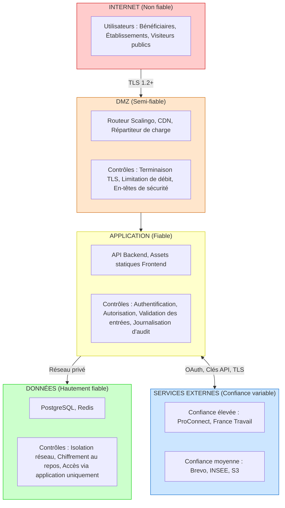

# Immersion Facilitée - Documentation Sécurité

> Généré par OpenSecKit v4.0.0 - /osk-discover (Phase 6 : Synthèse)
>
> **Public cible** : Ingénieurs Sécurité, DevOps, Architectes

---

## Tableau de bord Sécurité

| Métrique | Valeur |
|----------|--------|
| **Score de santé** | 87/100 |
| **Lacunes critiques** | 1 |
| **Lacunes élevées** | 3 |
| **Lacunes moyennes** | 7 |
| **Lacunes faibles** | 3 |
| **Lacunes résolues** | 4 |
| **Lacunes en cours** | 1 |
| **Contrôles documentés** | 24 |
| **Niveau SLSA** | Non implémenté |

> **Mise à jour 2026-01-28** :
> - GAP-001 résolu : Politique de gestion des incidents Plateforme Inclusion (RSSI)
> - GAP-003 résolu : AIPD réalisée et validée
> - GAP-005 résolu : GitGuardian actif dans la CI
> - GAP-008 résolu : Datadog EU via drain Scalingo (15j rétention + archives)
> - GAP-018 en cours : Environnement pentest et bug bounty déployés

### Couverture des contrôles

| Catégorie | Contrôles | Efficacité |
|-----------|-----------|------------|
| Authentification | 7 | Élevée |
| Autorisation | 3 | Élevée |
| Chiffrement | 3 | Élevée |
| Journalisation | 3 | Élevée |
| Réseau | 4 | Élevée |
| Validation des entrées | 3 | Élevée |

---

## Architecture de confiance

### Zones de confiance

### Frontières de confiance

| Frontière | De | Vers | Contrôles |
|-----------|-----|------|-----------|
| Internet → DMZ | Non fiable | Semi-fiable | TLS, WAF (manquant), Limitation de débit |
| DMZ → Application | Semi-fiable | Fiable | Authentification, Validation de session |
| Application → Données | Fiable | Hautement fiable | Requêtes paramétrées, Isolation réseau |
| Application → Externe | Fiable | Variable | OAuth, Clés API, TLS |

---

## Inventaire des contrôles de sécurité

### Authentification

| ID | Contrôle | Type | Efficacité |
|----|----------|------|------------|
| `ctrl-jwt-auth` | Authentification JWT | Basé sur token | Élevée |
| `ctrl-magic-link` | Authentification Magic Link | Sans mot de passe | Moyenne |
| `ctrl-proconnect-auth` | ProConnect OAuth | OAuth2/OIDC | Élevée |
| `ctrl-ft-connect-auth` | France Travail Connect | OAuth2 | Élevée |
| `ctrl-api-key-auth` | Authentification par clé API | Clé API | Moyenne |
| `ctrl-session-management` | Gestion des sessions | Sans état+Cache | Élevée |
| `ctrl-token-rotation` | Rotation des clés JWT | Rotation de clés | Moyenne |

### Autorisation

| ID | Contrôle | Modèle | Efficacité |
|----|----------|--------|------------|
| `ctrl-rbac` | Contrôle d'accès basé sur les rôles | RBAC | Élevée |
| `ctrl-resource-auth` | Autorisation basée sur les ressources | Basé sur ressources | Élevée |
| `ctrl-api-consumer-auth` | Autorisation des consommateurs API | Basé sur consommateur | Élevée |

### Chiffrement

| ID | Contrôle | Portée | Efficacité |
|----|----------|--------|------------|
| `ctrl-encryption-transit` | Chiffrement en transit | Toutes communications | Élevée |
| `ctrl-encryption-rest` | Chiffrement au repos (SecNumCloud) | Base de données, Stockage | Élevée |
| `ctrl-jwt-signing` | Signature cryptographique JWT | Tokens d'auth | Élevée |

### Journalisation

| ID | Contrôle | Rétention | SIEM |
|----|----------|-----------|------|
| `ctrl-request-logging` | Journalisation des requêtes HTTP | 30 jours | Non |
| `ctrl-error-tracking` | Suivi des erreurs (Sentry) | 90 jours | Non |
| `ctrl-audit-logging` | Piste d'audit | 1 an | Non |

### Réseau

| ID | Contrôle | Type | Efficacité |
|----|----------|------|------------|
| `ctrl-rate-limiting` | Limitation de débit | Limitation de débit | Élevée |
| `ctrl-network-isolation` | Isolation réseau | Segmentation | Élevée |
| `ctrl-ip-filtering` | Filtrage IP | Liste blanche | Moyenne |
| `ctrl-security-headers` | En-têtes de sécurité | En-têtes HTTP | Élevée |

---

## Processus de sécurité

| Processus | Fréquence | Responsable | Documenté |
|-----------|-----------|-------------|-----------|
| Mises à jour des dépendances | Continue | Équipe Dev | Oui |
| Revue de code | Par PR | Équipe Dev | Oui |
| Tests automatisés | Par commit | Équipe Dev | Oui |
| Sauvegarde base de données | Quotidienne + PiTR | Plateforme | ✅ Oui |
| Réponse aux incidents | Sur incident | RSSI Plateforme Inclusion | ✅ Oui |

> **Sauvegardes Scalingo (Starter Plan)** : Backups quotidiens (7j) + hebdomadaires (4 sem) + Point-in-Time Recovery sur 7 jours. RPO < 1 minute avec PiTR.

---

## Analyse de la surface d'attaque

### Surface d'attaque externe

| Point d'entrée | Authentification | Limitation de débit | Menaces |
|----------------|------------------|---------------------|---------|
| API publique | Magic Link / OAuth | Oui | Force brute, DoS |
| Dashboard Agences | ProConnect | Oui | Prise de contrôle de compte |
| API Partenaires | Clé API | Oui | Compromission de clé |
| Webhooks | Filtrage IP | Partiel | Usurpation |
| Adminer (BDD) | Scalingo credentials | N/A (interne) | Accès non autorisé |

### Environnement de test de sécurité

| Environnement | URL | Objectif |
|---------------|-----|----------|
| **Pentest** | https://pentest.immersion-facile.beta.gouv.fr | Bug bounty, tests de pénétration |

> Environnement isolé avec données synthétiques pour les tests de sécurité externes.

### Données à risque

| Type de données | Classification | Volume | Impact en cas de fuite |
|-----------------|----------------|--------|------------------------|
| Données de santé (RQTH) | Sensible | Faible | **Critique** |
| Identifiants personnels | Personnel | Élevé | Élevé |
| Données de convention | Métier | Élevé | Moyen |
| Tokens d'authentification | Secret | Moyen | Élevé |

### Intégrations externes

| Intégration | Données échangées | Sécurité | Niveau de risque |
|-------------|-------------------|----------|------------------|
| France Travail | Identité utilisateur, Conventions | OAuth2, TLS | Moyen |
| ProConnect | Identité utilisateur | OIDC, TLS | Faible |
| Brevo | DCP (email, téléphone) | Clé API, TLS | Moyen |
| INSEE SIRENE | Données entreprises | OAuth, TLS | Faible |
| S3 (Cellar) | Documents | IAM, TLS | Moyen |

---

## Sécurité de la chaîne d'approvisionnement

### Dépendances

| Aspect | Statut |
|--------|--------|
| Gestionnaire de paquets | pnpm avec lockfile |
| Scan de vulnérabilités | npm audit (CI) |
| Conformité des licences | Non automatisé |
| Génération SBOM | Non implémenté |
| Provenance SLSA | Non implémenté |

### Correctifs de sécurité

Le projet utilise `pnpm.overrides` pour les correctifs de sécurité :
- Revue régulière des dépendances vulnérables
- Correctifs manuels via overrides quand les correctifs upstream ne sont pas disponibles

### Sécurité des artefacts

| Aspect | Statut |
|--------|--------|
| Signature des conteneurs | Non implémenté |
| Provenance des builds | Non implémenté |
| Sécurité du registre | Géré par Scalingo |

---

## Lacunes de sécurité critiques

### ~~GAP-001 : Absence de procédure de réponse aux incidents~~ ✅ RÉSOLU

**Résolu le** : 2026-01-28

**Résolution** : Politique de gestion des incidents existante à l'échelle de la **Plateforme de l'inclusion**. Le **RSSI** assume les rôles de Security Champion et Incident Responder en chef pour l'ensemble des produits de la plateforme.

---

### GAP-002 : Données de santé sans protection renforcée (Critique)

**Score de risque** : 72/100 *(réduit suite à la validation de l'AIPD)*

**Description** : Le champ `isRqth` (reconnaissance de travailleur handicapé) constitue une donnée de santé au sens de l'article 9 du RGPD. Ces données sensibles ne bénéficient pas encore d'un chiffrement au niveau applicatif ni d'une journalisation d'accès dédiée.

**Contexte infrastructure** :
- Hébergement : Scalingo sur zone **SecNumCloud** (osc-secnum-fr1)
- Certification HDS : **Non** (non requis si volume faible et AIPD validée)

**Impact** :
- Non-conformité partielle à l'article 9 du RGPD
- Risque accru en cas de fuite de données

**Remédiation** :
1. Auditer les patterns d'accès actuels au champ `isRqth`
2. Implémenter un chiffrement au niveau du champ
3. Ajouter une journalisation d'accès dédiée pour les données de santé
4. ~~Compléter et documenter l'AIPD~~ ✅ Complété (2026-01-28)

**Responsable** : Équipe Core | **Priorité** : Immédiate | **Effort** : Élevé

---

### Autres lacunes prioritaires

| ID | Titre | Score de risque | Responsable |
|----|-------|-----------------|-------------|
| GAP-004 | Runbooks opérationnels non documentés | 54 | Équipe Plateforme |
| GAP-006 | Test de restauration de sauvegarde non effectué | 48 | Équipe Plateforme |
| GAP-007 | MFA non obligatoire pour tous les admins | 45 | Équipe Core |

### Lacunes résolues

| ID | Titre | Date de résolution | Résolution |
|----|-------|--------------------|------------|
| GAP-001 | Procédure de réponse aux incidents | 2026-01-28 | Politique Plateforme Inclusion (RSSI) |
| GAP-003 | AIPD documentée | 2026-01-28 | AIPD validée |
| GAP-005 | Scan de secrets automatisé | 2026-01-28 | GitGuardian actif dans CI GitHub |
| GAP-008 | Centralisation des logs (SIEM) | 2026-01-28 | Datadog EU via drain Scalingo |

---

## Certifications infrastructure

| Certification | Statut | Détail |
|---------------|--------|--------|
| **SecNumCloud** | ✅ Oui | Zone osc-secnum-fr1 (Outscale, certifiée ANSSI) |
| **HDS** | ❌ Non | Non requis (volume faible de données de santé, AIPD validée) |
| **ISO 27001** | ✅ Oui | Via Scalingo/Outscale |

> **Note** : L'hébergement sur zone SecNumCloud garantit un niveau de sécurité élevé conforme aux exigences de l'ANSSI pour les données sensibles de l'État français. La certification HDS n'est pas requise car le traitement de données de santé (champ `isRqth`) reste accessoire à l'activité principale et une AIPD a été validée.

---

## Statut de conformité

### RGPD (Règlement Général sur la Protection des Données)

| Exigence | Statut | Lacune |
|----------|--------|--------|
| Minimisation des données | Conforme | - |
| Limitation des finalités | Conforme | - |
| Gestion du consentement | Conforme | - |
| Droits des personnes concernées | Implémenté | - |
| AIPD | ✅ **Validée** (2026-01-28) | ~~GAP-003~~ |
| Notification de violation | ✅ **Documentée** (Politique PI) | ~~GAP-001~~ |
| Données sensibles (Art. 9) | **Partiel** (AIPD ok, chiffrement en attente) | GAP-002 |

### RGS (Référentiel Général de Sécurité)

| Exigence | Statut | Lacune |
|----------|--------|--------|
| Authentification | Conforme (ProConnect) | - |
| Contrôle d'accès | Conforme | - |
| Traçabilité | ✅ Conforme (Datadog EU) | ~~GAP-008~~ |
| Réponse aux incidents | ✅ Documentée (RSSI) | ~~GAP-001~~ |

### RGAA (Accessibilité)

| Exigence | Statut |
|----------|--------|
| Conformité DSFR | Conforme |

---

## Réponse aux incidents

> Politique gérée au niveau **Plateforme de l'inclusion** par le **RSSI**.

### Couverture

| Paramètre | Valeur |
|-----------|--------|
| **Horaires** | Lun-Ven 9h-18h (jours ouvrés) |
| **Astreinte** | ❌ Non |
| **SLA garanti** | Jours ouvrés uniquement |
| **Hors horaires** | Best effort, SLA non garanti |

### Classification de gravité

| Gravité | Description | Réponse (J.O.) | Résolution (J.O.) |
|---------|-------------|----------------|-------------------|
| Critique | Fuite de données, Compromission système | 1h | 4h |
| Élevée | Vulnérabilité de sécurité exploitée | 4h | 1 jour |
| Moyenne | Activité suspecte détectée | 1 jour | 3 jours |
| Faible | Problème de sécurité mineur | 3 jours | 5 jours |

*J.O. = Jours Ouvrés. Hors jours ouvrés : best effort, prochain jour ouvré.*

### Contacts clés

| Rôle | Organisation |
|------|--------------|
| **RSSI** | Plateforme de l'inclusion |
| **DPO** | Plateforme de l'inclusion |

### Escalade

La matrice d'escalade est définie dans la **politique de gestion des incidents de la Plateforme de l'inclusion**.

| Contact externe | Disponibilité |
|-----------------|---------------|
| CNIL | Heures ouvrées |

---

## Outillage de sécurité

| Outil | Objectif | Statut |
|-------|----------|--------|
| CodeQL | SAST (analyse statique) | ✅ Actif (GitHub CI) |
| GitGuardian | Scan de secrets | ✅ Actif (GitHub CI) |
| Dependabot | Scan de dépendances | ✅ Actif (alertes + PRs auto) |
| Biome | Linting sécurité | ✅ Actif |
| Playwright | Tests de sécurité E2E | Partiel |
| Tests de pénétration | Évaluation externe | ✅ Env dédié (pentest.immersion-facile) |
| Datadog EU | SIEM / Agrégation logs | ✅ Actif (drain Scalingo, 15j rétention) |
| WAF | Pare-feu applicatif web | **Non implémenté** |

---

## Recommandations

### Actions immédiates (Ce sprint)

1. **Implémenter la protection des données RQTH** (GAP-002) - **SEUL GAP CRITIQUE**
   - Ajouter le chiffrement au niveau du champ
   - Implémenter la journalisation d'accès
   - ~~Documenter l'AIPD~~ ✅ Complété

### Actions à court terme (Ce trimestre)

2. Documenter les runbooks opérationnels (GAP-004)
3. Tester la restauration des sauvegardes (GAP-006)
4. Imposer le MFA pour les rôles admin (GAP-007)

### Actions à moyen terme (Trimestre suivant)

5. Implémenter les magic links à usage unique (GAP-010)
6. Améliorer le filtrage des DCP dans les logs (GAP-011)
7. Évaluer l'implémentation d'un WAF (GAP-015)
8. Établir une politique de rotation des secrets (GAP-009)

---

## Références

- [Modèle système](./../system-model/index.yaml)
- [Frontières de confiance](./../system-model/boundaries.yaml)
- [Contrôles de sécurité](./../system-model/controls.yaml)
- [Classification des données](./../system-model/data.yaml)
- [Analyse des lacunes](./../system-model/gaps.yaml)

---

*Généré par OpenSecKit v4.0.0*
