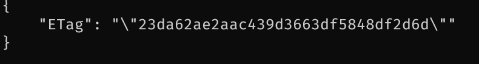

# Créer un bucket sur l'addon cellar

## Outil de manipulation

Nous avons besoin d'un outil pour manipuler les configurations des buckets.

Pour faciliter un déploiement automatisé et une possibilité d'architecture nous allons utiliser dans ce tutoriel la [cli aws via docker](https://hub.docker.com/r/amazon/aws-cli) pour gérer les buckets eux-mêmes.
La liste des autres options (s3cmd | AWS Sdk) est disponible ici : [https://www.clever-cloud.com/doc/deploy/addon/cellar/](https://www.clever-cloud.com/doc/deploy/addon/cellar/)  
La configuration des s3 se manipule via la cli aws.

```
docker pull amazon/aws-cli
```

## Prérequis: Récupérer les variables d'environement pour la cli

Récupérer les secrets sur la console
https://console.clever-cloud.com > Addons > Votre addon Cellar > Informations > Variables d'environement

(Pas trouvé de moyen de récupérer en cli les valeurs des variables environment de l'addon)

Récupérer les variables d'environnement :
CELLAR_ADDON_HOST="cellar-c2.services.clever-cloud.com"
CELLAR_ADDON_KEY_ID="XXX"
CELLAR_ADDON_KEY_SECRET="YYY"

CELLAR_ADDON_KEY_ID et CELLAR_ADDON_KEY_SECRET correspondent aux identifiants Aws AWS_ACCESS_KEY_ID et AWS_SECRET_ACCESS_KEY pour la cli.

## Créer le bucket en pas-à-pas (optionnel)

Documentation clevercloud : [https://www.clever-cloud.com/doc/deploy/addon/cellar/#using-aws-cli](https://www.clever-cloud.com/doc/deploy/addon/cellar/#using-aws-cli)

### Recommandé avec Docker (sans installation de la cli aws en local)

#### Création d'un bucket public en lecture

:warning: mettre un nom de bucket en lowercase !

```shell
docker run --env AWS_ACCESS_KEY_ID=CELLAR_ADDON_KEY_ID --env AWS_SECRET_ACCESS_KEY=CELLAR_ADDON_KEY_SECRET amazon/aws-cli s3api create-bucket --bucket monsuperbucket --acl public-read --endpoint-url https://cellar-c2.services.clever-cloud.com
```

Pour plus d'information sur les options possibles de l'api s3 :
[https://docs.aws.amazon.com/cli/latest/userguide/cli-services-s3-apicommands.html](https://docs.aws.amazon.com/cli/latest/userguide/cli-services-s3-apicommands.html)
[https://docs.aws.amazon.com/AmazonS3/latest/userguide/creating-buckets-s3.html](https://docs.aws.amazon.com/AmazonS3/latest/userguide/creating-buckets-s3.html)

## Créer le bucket avec une action github

### Ajouter les secrets sur le repo (URL_DU_REPO/settings/secrets/actions)

Créer les secrets avec les valeurs récupérés précédement
CELLAR_ADDON_HOST="cellar-c2.services.clever-cloud.com"
CELLAR_ADDON_KEY_ID="XXX"
CELLAR_ADDON_KEY_SECRET="YYY"

### Rajouter l'action dans le dossier workflows

.github/workflows/create-s3-bucket.cellar.yml

### Executer l'action

- Executer l'action: "Setup - Cellar add a bucket with public read rights" disponible sur URL_DU_REPO/actions en donnant le nom voulu au bucket.

## Uploader un fichier de test en cli (optionel)

Soit un fichier "cats.png" dans votre shell courant

Explication des options docker
--mount type=bind,source="$(pwd)"/cats.png,target=/cats.png => Lie un fichier local sur le conteneur.

Options nécessaires de 's3api put-object'
--key cats.png => chemin absolu du fichier sur le bucket
--body ../cats.png => chemin relatif du contenu du fichier en local (../cats.png sur le conteneur)
--bucket mybucket => identifiant du bucket

```shell
docker run --mount type=bind,source="$(pwd)"/cats.png,target=/cats.png --env AWS_ACCESS_KEY_ID=CELLAR_ADDON_KEY_ID --env AWS_SECRET_ACCESS_KEY=CELLAR_ADDON_KEY_SECRET amazon/aws-cli s3api put-object --key cats.png --body ../cats.png --bucket monsuperbucket --endpoint-url https://cellar-c2.services.clever-cloud.com
```

Format de réponse :


## Url des fichiers

Les fichiers sont disponibles sur https://<bucket-name>.cellar-c2.services.clever-cloud.com/CHEMIN_DU_FICHIER

eg: pour les commandes précédentes: `https://monsuperbucket.cellar-c2.services.clever-cloud.com/cats.png`
