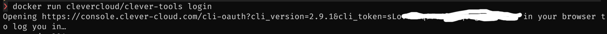
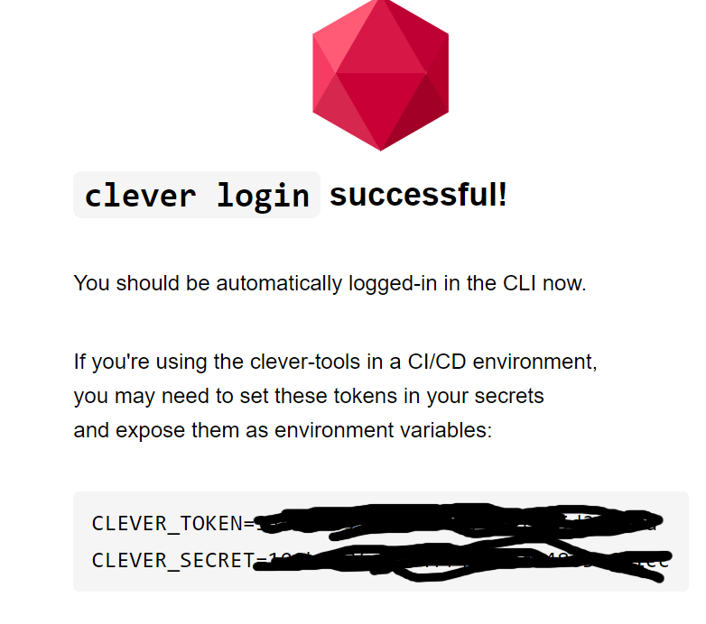
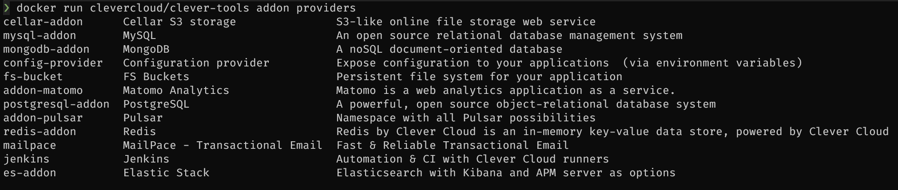
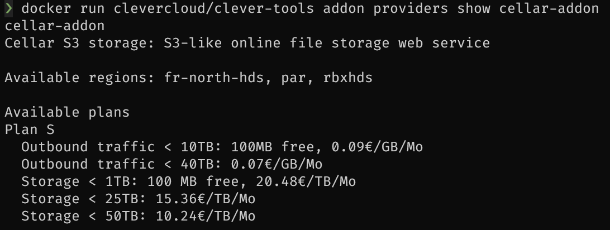

# Créer un compte clevercloud

## Prérequis: Récupérer les variables d'environement pour la cli

1. Se logger avec Docker (sans installation de la cli en local)

```
docker run clevercloud/clever-tools login
```

1.1 (Alternative) Avec l'action Setup - Clevercloud get secrets
Executer l'action 'Setup - Clevercloud get secrets'

2.Copier l'url donnée dans un navigateur:


3. Se logger sur votre compte puis récupérer les valeurs affichées.



CLEVER_TOKEN et CLEVER_SECRET (les garder pour la suite)

## Créer l'addon en pas à pas (optionnel)

### Tester l'appel à la cli

En passant les tokens récupérés à l'étape précédente à l'image docker vous pouvez tester la cli rapidement

```shell
docker run --env CLEVER_TOKEN=TOKEN_VALUE --env CLEVER_SECRET=SECRET_VALUE clevercloud/clever-tools --help
```

eg :


#### Lister les addons providers

:warning: Cette commande doit être executée sans les variables d'authentification

```shell
 docker run clevercloud/clever-tools addon providers
```



#### Lister les plan d'un addon (eg cellar)

:warning: Cette commande doit être executée sans les variables d'authentification

```shell
docker run clevercloud/clever-tools addon providers show cellar-addon
```



On voit que le seul plan disponible est le plan 'S'

#### Créer l'addon cellar

```shell
docker run --env CLEVER_TOKEN=TOKEN_VALUE --env CLEVER_SECRET=CLEVER_SECRET clevercloud/clever-tools addon create cellar-addon mycellar --plan S
```

## Créer l'addon avec une action github

### Ajouter les secrets sur le repo (URL_DU_REPO/settings/secrets/actions)

Créer les secrets CLEVER_TOKEN et CLEVER_SECRET avec les valeurs associées

### Rajouter l'action dans le dossier workflows

.github/workflows/setup-s3-cellar.clevercloud.yml

### Executer l'action

- Executer l'action: "Setup - Cellar - Add Addon On Clevercloud" disponible sur URL_DU_REPO/actions en donnant le nom voulu à l'addon.

## NEXT : [Créer un bucket](s3-bucket-creation.md)
